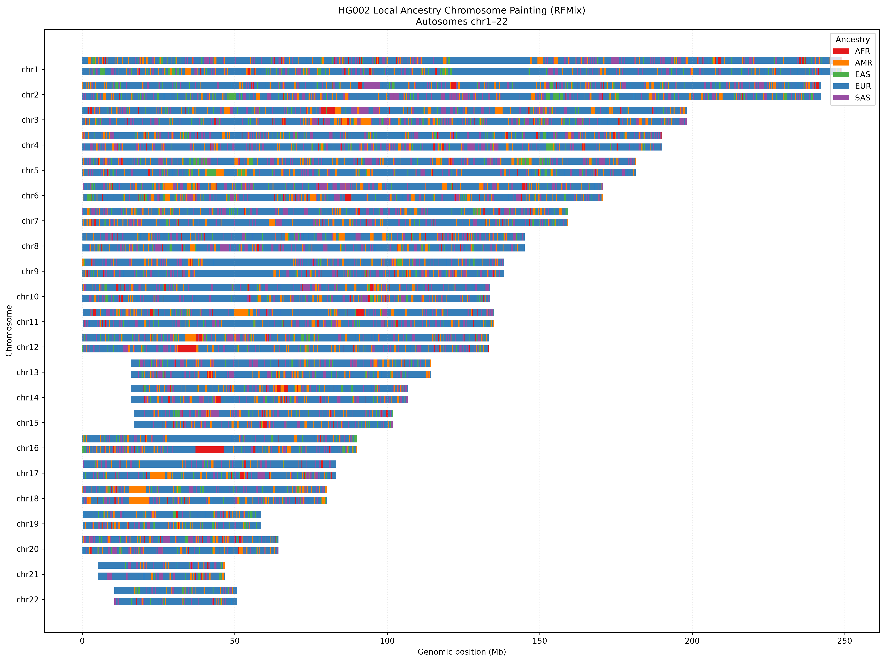

# Ancestry Chromosome Painting

Chromosome level ancestry workflow for whole genome sequencing data.

The pipeline was tested using the GIAB HG002 sample sequenced with Ultima Genomics. It starts from a CRAM aligned to GRCh38, performs chromosome level variant calling with EfficientDV, phases the variants with Beagle, runs local ancestry inference with RFMix using the 1000 Genomes Project reference panel, and generates chromosome painting figures.

The current workflow covers chromosomes 1-22.

## Workflow

The main steps are:

1. Generate chromosome specific EfficientDV configuration files
2. Run chromosome level variant calling
3. Filter and harmonize the study VCFs with the 1KGP reference panel
4. Phase the study sample with Beagle
5. Run RFMix for local ancestry inference
6. Plot the chromosome painting

## Test dataset

The workflow was tested with HG002 from Genome in a Bottle (GIAB).

| Field | Value |
|---|---|
| Sample | HG002 |
| CRAM sample ID | L7386 |
| Platform | Ultima Genomics |
| Reference | GRCh38 / hg38 |
| Input | CRAM + CRAI |
| CRAM used | `414004-L7386-Z0114-CAACATACATCAGAT.cram` |

GIAB information:

https://www.nist.gov/programs-projects/genome-bottle

The CRAM file is not included in this repository.

## Reference data

### GRCh38

Variant calling was performed against GRCh38/hg38.

Reference FASTA used during testing:

```text
Homo_sapiens_assembly38.fasta
```

GIAB reference resources:

https://ftp-trace.ncbi.nlm.nih.gov/ReferenceSamples/giab/release/references/

### 1000 Genomes Project

Local ancestry inference uses the high-coverage 1000 Genomes Project panel on GRCh38.

Dataset information:

https://www.internationalgenome.org/faq/what-are-the-different-data-collections-available-for-1000-genomes/

Phased high-coverage VCFs:

https://ftp.1000genomes.ebi.ac.uk/vol1/ftp/data_collections/1000G_2504_high_coverage/working/20220422_3202_phased_SNV_INDEL_SV/

The high-coverage collection contains 3,202 samples sequenced at approximately 30x and analyzed on GRCh38.

The ancestry groups used in the RFMix reference are:

- AFR - African
- AMR - Admixed American
- EAS - East Asian
- EUR - European
- SAS - South Asian

### Genetic maps

GRCh38 PLINK genetic maps used for Beagle and RFMix can be downloaded from:

https://bochet.gcc.biostat.washington.edu/beagle/genetic_maps/plink.GRCh38.map.zip

More details about the reference files are available in:

```text
resources/README.md
```

## Requirements

The workflow uses:

- miniwdl
- Ultima HealthOmics EfficientDV workflow
- bcftools
- Java
- Beagle
- RFMix
- Python 3
- Matplotlib

The large reference datasets and software binaries are not included in this repository.

## Usage

### 1. Generate EfficientDV chromosome configs

An example configuration is available at:

```text
configs/example_chr.json
```

Generate configs for chromosomes 1-22 with:

```bash
python3 scripts/generate_chr_configs.py \
  --cram /path/to/sample.cram \
  --crai /path/to/sample.cram.crai \
  --model /path/to/ultima-germline-model.onnx \
  --sample HG002
```

The generated configs are written to:

```text
configs/generated/
```

### 2. Run chromosome-level variant calling

Set the path to the EfficientDV WDL and run:

```bash
WDL=/path/to/efficient_dv.wdl \
bash scripts/run_variant_calling.sh
```

The script processes chromosomes 1-22 separately.

### 3. Run local ancestry analysis

Before running this step, update the paths for the 1KGP reference panel, population labels, Beagle, RFMix and genetic maps if they are stored outside the default project structure.

Run:

```bash
bash scripts/run_ancestry_chr1_22.sh
```

For each chromosome, this script performs:

- study SNP filtering
- 1KGP SNP filtering
- shared-marker selection
- preparation of the ancestry-labelled 1KGP reference
- Beagle phasing
- genetic map conversion
- RFMix local ancestry inference

### 4. Plot chromosome painting

Generate the combined chromosome painting:

```bash
python3 scripts/plot_chromosome_painting.py
```

Generate separate plots for each chromosome:

```bash
python3 scripts/plot_each_chromosome.py
```

## Example result

Combined chromosome painting for HG002 across chromosomes 1-22:



The ancestry classes in the plot correspond to AFR, AMR, EAS, EUR and SAS.

## Repository structure

```text
Ancestry_Chromosome_Painting/
├── configs/
│   └── example_chr.json
├── docs/
│   └── figures/
│       └── chromosome_painting_example.png
├── resources/
│   └── README.md
├── scripts/
│   ├── generate_chr_configs.py
│   ├── run_variant_calling.sh
│   ├── run_ancestry_chr1_22.sh
│   ├── plot_chromosome_painting.py
│   └── plot_each_chromosome.py
├── .gitignore
└── README.md
```

## Output

Main outputs include:

- chromosome-specific study VCFs
- harmonized study and 1KGP VCFs
- phased study VCFs
- RFMix local ancestry results
- combined chromosome painting
- individual chromosome painting figures

Large input files, reference datasets and generated results are excluded from Git.
