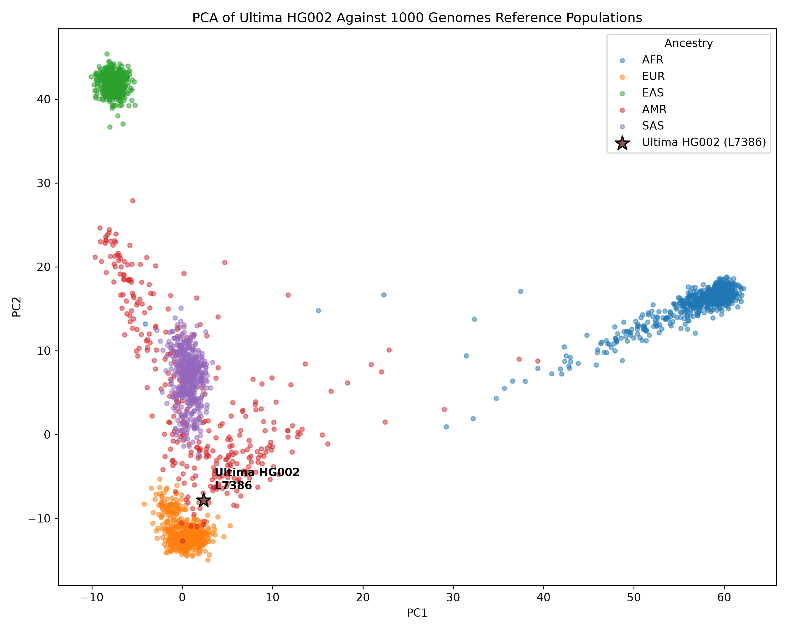

# Global Ancestry with Somalier

This folder contains the global ancestry workflow used for the HG002 Ultima Genomics sample.

The workflow uses Somalier to extract ancestry-informative variants from the CRAM, compares the study sample with a 1000 Genomes Project reference panel, and reports ancestry probabilities together with PCA coordinates.

## Workflow

1. Somalier extraction from the study CRAM
2. Comparison against the 1KGP Somalier reference panel
3. Global ancestry estimation
4. PCA visualization

## Main output

Somalier ancestry produces a table containing:

```text
sample_id
predicted_ancestry
given_ancestry
AFR_prob
EUR_prob
EAS_prob
AMR_prob
SAS_prob
PC1
PC2
...
PC10
```

The ancestry probability columns correspond to:

- AFR - African
- AMR - Admixed American
- EAS - East Asian
- EUR - European
- SAS - South Asian

## Reference data

This workflow uses:

- GRCh38 / hg38
- Somalier GRCh38 ancestry sites
- 1KGP Somalier reference samples
- 1KGP ancestry labels

Update the paths in `main.nf` or provide them as parameters before running.

## Run

Example:

```bash
nextflow run main.nf \
  --input samplesheets/example.csv \
  --sites /path/to/sites.hg38.vcf.gz \
  --sites_index /path/to/sites.hg38.vcf.gz.tbi \
  --fasta /path/to/Homo_sapiens_assembly38.fasta \
  --reference /path/to/1kg-somalier \
  --labels /path/to/ancestry-labels-1kg.tsv \
  --outdir results \
  -with-conda
```

## PCA example

Example PCA result from the HG002 Ultima Genomics analysis:


